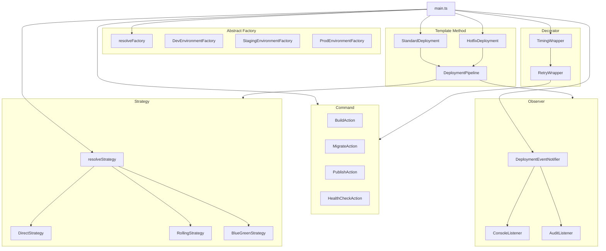

# Design Patterns Example — Deployment Pipeline

Proyecto académico en **TypeScript** que implementa **6 patrones de diseño clásicos** dentro de un pipeline de deployment simulado. Cada patrón resuelve un problema concreto del dominio y está justificado con notas sobre por qué *no* se usó un patrón alternativo.

## Patrones implementados

| Patrón | Categoría | Archivo principal |
|---|---|---|
| Abstract Factory | Creacional | `src/environment/environment.factory.ts` |
| Command | Comportamiento | `src/deployment/deployment.actions.ts` |
| Decorator | Estructural | `src/shared/action.wrappers.ts` |
| Observer | Comportamiento | `src/deployment/deployment.notifier.ts` |
| Strategy | Comportamiento | `src/deployment/deployment.executor.ts` |
| Template Method | Comportamiento | `src/deployment/deployment.pipeline.ts` |

---

## Estructura del proyecto

```
src/
├── main.ts                          # Punto de entrada y composición de objetos
├── types.ts                         # Interfaces y contratos del sistema
├── environment/
│   ├── environment.config.ts        # Implementaciones concretas por entorno
│   └── environment.factory.ts       # Abstract Factory (dev / staging / prod)
├── deployment/
│   ├── deployment.actions.ts        # Command — acciones del pipeline
│   ├── deployment.executor.ts       # Strategy — algoritmos de ejecución
│   ├── deployment.notifier.ts       # Observer — sistema de notificaciones
│   └── deployment.pipeline.ts      # Template Method — esqueleto del pipeline
└── shared/
    └── action.wrappers.ts           # Decorator — wrappers transversales
```

---

## Requisitos

- [Bun](https://bun.sh/) >= 1.0

---

## Ejecución

```sh
bun run src/main.ts <entorno> <estrategia> [hotfix]
```

### Argumentos

| Argumento | Valores posibles | Predeterminado |
|---|---|---|
| `<entorno>` | `dev` · `staging` · `prod` | `dev` |
| `<estrategia>` | `direct` · `rolling` · `blue-green` | `direct` |
| `[hotfix]` | `hotfix` *(literal)* | — |

### Ejemplos

```sh
# Deployment estándar en desarrollo con estrategia directa
bun run src/main.ts dev direct

# Deployment en producción con Blue-Green
bun run src/main.ts prod blue-green

# Hotfix urgente en staging con rolling update
bun run src/main.ts staging rolling hotfix
```

---

## Descripción de los patrones

### Abstract Factory — `environment/`

Crea familias coherentes de objetos (`Logger`, `DatabaseConfig`, `Runner`) según el entorno activo. El resto del sistema solo conoce las interfaces; cambiar de `dev` a `prod` no requiere modificar ningún archivo fuera de la fábrica.

```
resolveFactory("prod")
  └─► ProdEnvironmentFactory
        ├─► ProdLogger
        ├─► ProdRunner
        └─► prodDb
```

---

### Command — `deployment/deployment.actions.ts`

Cada paso del deployment (`BuildAction`, `MigrateAction`, `PublishAction`, `HealthCheckAction`) se encapsula como un objeto con `execute()` y `undo()`. El pipeline no sabe qué hace cada acción, lo que habilita rollback ordenado y extensión sin modificar código existente.

---

### Decorator — `shared/action.wrappers.ts`

Añade comportamiento transversal a las acciones sin modificarlas ni generar una explosión de subclases.

| Wrapper | Comportamiento añadido |
|---|---|
| `RetryWrapper` | Reintenta la acción hasta N veces ante fallo |
| `TimingWrapper` | Mide y registra el tiempo de ejecución |

Se pueden combinar libremente:

```ts
new TimingWrapper(new RetryWrapper(new BuildAction(...)))
```

---

### Observer — `deployment/deployment.notifier.ts`

`DeploymentEventNotifier` mantiene una lista de listeners y los notifica en cada cambio de fase. Añadir un nuevo tipo de listener (webhook, métricas, etc.) no requiere tocar el pipeline ni las acciones.

| Listener | Descripción |
|---|---|
| `ConsoleListener` | Imprime cada evento en consola |
| `AuditListener` | Acumula un log con timestamp accesible mediante `getLog()` |

---

### Strategy — `deployment/deployment.executor.ts`

El algoritmo de ejecución se selecciona en runtime sin modificar el pipeline. Cada estrategia implementa `ExecutionStrategy`.

| Estrategia | Comportamiento |
|---|---|
| `DirectStrategy` | Ejecuta todas las acciones una sola vez en secuencia |
| `RollingStrategy` | Repite el ciclo de acciones en 3 instancias de forma sucesiva |
| `BlueGreenStrategy` | Despliega en el entorno inactivo (Green) y redirige el tráfico al final |

---

### Template Method — `deployment/deployment.pipeline.ts`

`DeploymentPipeline` define el esqueleto fijo del proceso:

```
deploy()
  ├── validate()   ← abstracto, lo define la subclase
  ├── prepare()    ← abstracto, lo define la subclase
  ├── execute()    ← delega en Strategy
  └── rollback()   ← invocado solo si hay error
```

Las subclases concretas implementan solo los pasos variables:

| Subclase | Comportamiento |
|---|---|
| `StandardDeployment` | Validaciones y preparación completas |
| `HotfixDeployment` | Validación mínima y preparación acelerada |

---

## Diagrama de arquitectura


